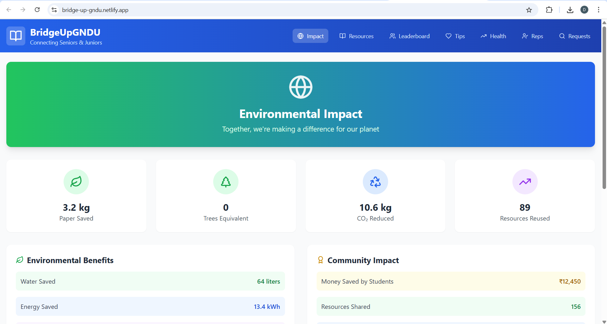
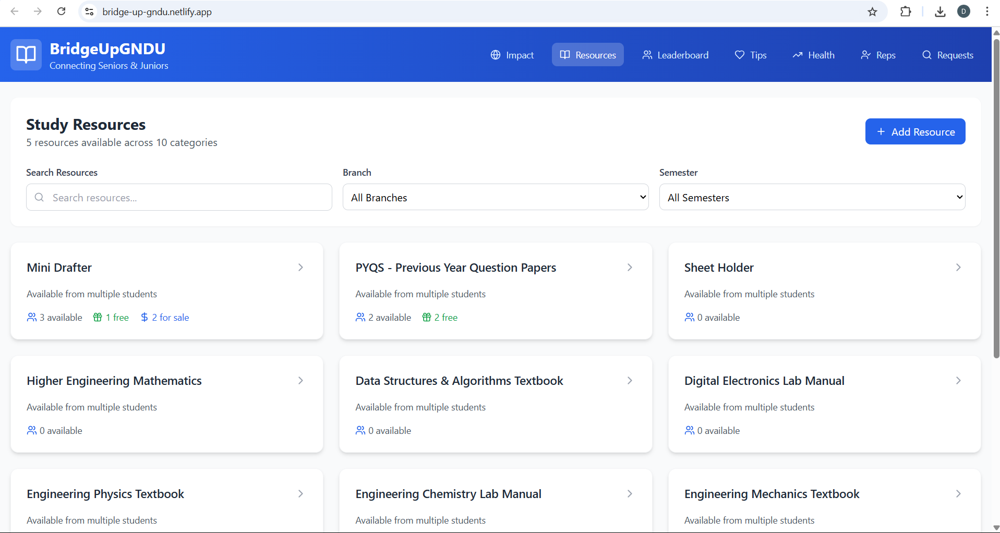
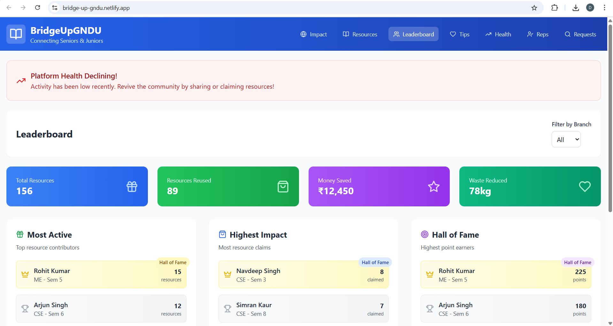
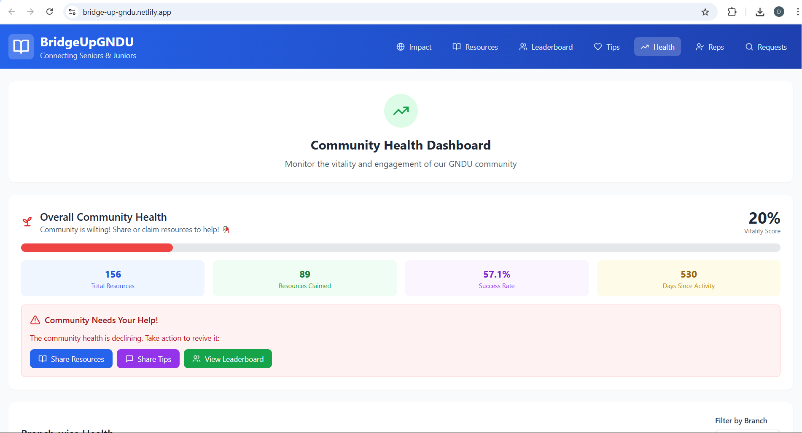

# 🫀 Bridge-Up GNDU


> *A Living Platform: Where Student Generosity Keeps the Campus Alive*

---

## 📚 Table of Contents
- [Introduction](#introduction)
- [Inspiration](#inspiration)
- [Alive Features](#-alive-features)
- [Why “Alive”?](#-why-alive)
- [Getting Started](#-getting-started)
- [Screenshots](#-screenshots)
- [Tech Stack](#-tech-stack)
- [Project Structure](#-project-structure)
- [Contributing](#-contributing)
- [License](#-license)

---

## 🪴 Introduction

**Bridge-Up GNDU** is more than a resource-sharing platform—it's a living, breathing community hub for Guru Nanak Dev University. Here, the platform’s very “health” and “spirit” depend on the actions, kindness, and engagement of its users.

### What does it mean for a platform to be “alive”?

On Bridge-Up GNDU, “alive” isn’t just a catchy word. The platform visually and functionally decays without meaningful student engagement—its “community health” bar will drop if people stop giving, claiming, helping, or suggesting. When students participate—by donating notes, fulfilling requests, or simply sharing ideas—the platform revives, its health bar rises, and everyone witnesses how their small acts keep the campus spirit thriving.

This is a new kind of digital campus:  
- **No passive resource dump.**  
- **No static notice board.**  
- Instead: a collaborative, dynamic space that needs YOU to survive and flourish.

---

## 🌱 Inspiration

Every semester, textbooks, notes, and essential resources change—while seniors have already used them and moved on. Yet, juniors often struggle to find the right materials or even to connect with seniors who might have exactly what they need. This isn’t a challenge unique to our campus; it’s an experience shared by students in universities and colleges everywhere.

Bridge-Up GNDU was born from the desire to bridge this gap. Let’s break the cycle of unused resources gathering dust and anxious searches for help. Together, we can set a new standard—where sharing, sustainability, and community support are the norm, not the exception.

> **Let’s be the change. Let’s save resources, support each other, and build a campus where generosity and connection keep the spirit alive.**

---

## 🚀 Alive Features

- **Community Health Bar:**  
  - The platform’s health drops with inactivity, just like a real community loses its spark when people stop caring.
  - Every donation, claim, request, suggestion, or fulfillment restores health.
  - See the direct impact of your engagement—your actions literally keep the site alive.

- **Impact Dashboard:**  
  - Instantly track the paper, money, and effort saved for the campus.
  - Watch as campus-wide participation translates to real-world impact.

- **Dynamic Leaderboards:**  
  - Recognize top contributors and branches who keep the platform “alive.”

- **Suggestion & Request Mechanisms:**  
  - Every suggestion or fulfilled request is a pulse—a sign of life from the campus community.

---

## 🫀 Why “Alive”?

> In most apps, engagement is a number. Here, it’s a heartbeat.  
> Bridge-Up GNDU’s unique mechanic reminds us that digital communities only thrive when we nurture them—just like our real campus.  
> If we stop showing up, the space fades. If we care, it flourishes.

---

## 🛠️ Getting Started

1. **Clone the repository**
   ```bash
   git clone https://github.com/Di49v/bridge-up-gndu.git
   cd bridge-up-gndu
   ```

2. **Install dependencies**
   ```bash
   npm install
   ```

3. **Run locally**
   ```bash
   npm run dev
   ```

4. **Build for production**
   ```bash
   npm run build
   ```

---

## 🖼️ Screenshots

<!-- Add screenshots/gifs here after deployment -->
- 
- 
- 
- 

---

## ⚡ Tech Stack

- **Frontend:** React (TypeScript, Vite)
- **Styling:** Tailwind CSS
- **Deployment:** Netlify
- **Mock Data:** TypeScript-based mocks for demo

---

## 🗂️ Project Structure

```
src/
│
├── components/           # All major UI components
│    ├── Header.tsx
│    ├── Footer.tsx
│    ├── ImpactPage.tsx
│    ├── ResourceList.tsx
│    ├── Leaderboard.tsx
│    ├── SuggestionBoard.tsx
│    ├── BranchRepresentatives.tsx
│    ├── CommunityHealthPage.tsx
│    ├── RequestsPage.tsx
│    └── ...more
│
├── data/
│    └── mockData.ts      # Demo/mock data for resources, users, stats
│
├── types/
│    └── index.ts         # TypeScript types for resources, users, etc.
│
├── App.tsx               # Main app, routing between pages
├── main.tsx              # React entry point
├── index.css             # Tailwind CSS imports
└── vite-env.d.ts
```

---

## 🤝 Contributing

Pull requests, feature ideas, and feedback are welcome!  
If you’d like to contribute, check out the issues or open a discussion.

---

## 📝 License

MIT

---

> Built with 💖 by Divleen Kaur for the GNDU community.